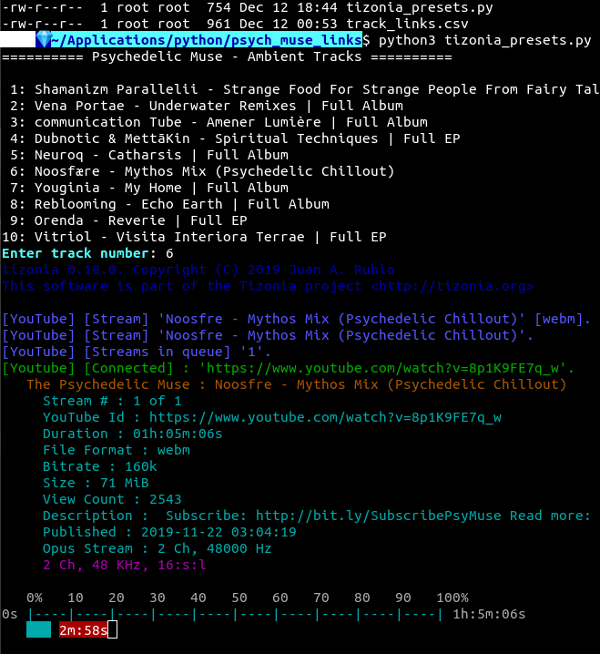

# tizonia_presets
Python 3: Tizonia music app presets: csv.reader, subprocess.run 



## subprocess

```python
import subprocess
```

[subprocess](https://docs.python.org/3/library/subprocess.html) module is imported to spawn the [tizonia](https://github.com/tizonia/tizonia-openmax-il#snap-package) music app which plays YouTube audio tracks listed in [ThePsychedelicMuse](https://www.youtube.com/user/ThePsychedelicMuse/videos) profile. In other words, `subprocess` enables Python to run Bash commands in the CLI. In this case, the `tizonia` music app will run.

**Note**: tizonia is a cross-platform application installed in an OS, so it is unavailable to this notebook.

<hr color="DarkOliveGreen" width="75%">

## csv.reader()

```python
from csv import reader
```

The [csv.reader()](https://docs.python.org/3/library/csv.html#csv.reader) method returns a reader object (`<_csv.reader object at 0x7f4340e24208>`) which is stored in the `csv_read` variable, and which iterates over the lines `track_links.csv`. 

### track_links.csv

```csv
========== Psychedelic Muse - Ambient Tracks ==========
Shamanizm Parallelii - Strange Food For Strange People From Fairy Tales Part 3: Dub | Full Album,https://www.youtube.com/watch?v=4UWJBdPm2dA
Vena Portae - Underwater Remixes | Full Album,https://www.youtube.com/watch?v=oVrFkqiUlbg
communication Tube - Amener Lumière | Full Album,https://www.youtube.com/watch?v=HcWmWify9Wc
Dubnotic & MettāKin - Spiritual Techniques | Full EP,https://www.youtube.com/watch?v=SCyBAAxX0xs
Neuroq - Catharsis | Full Album,https://www.youtube.com/watch?v=cCEphVJ0Tek
Noosfære - Mythos Mix (Psychedelic Chillout),https://www.youtube.com/watch?v=8p1K9FE7q_w
Youginia - My Home | Full Album,https://www.youtube.com/watch?v=ucfWPuvDC0M
Reblooming - Echo Earth | Full Album,https://www.youtube.com/watch?v=FR2jtc74dVU
Orenda - Reverie | Full EP,https://www.youtube.com/watch?v=HYtIpg4TEbs
Vitriol - Visita Interiora Terrae | Full EP,https://www.youtube.com/watch?v=EiDjuabl1FE 
```

`track_links.csv` contains a list of comma-separated values. Each line is a data record. Each record consists of a YouTube video name, followed by it's associated URL. So a comma becomes a field separator.

<hr color="DarkOliveGreen" width="75%">

### URL Dictionary

```python
urls = {}
```

```python
>>> import pprint
>>> pprint.pprint(urls)
{1: 'https://www.youtube.com/watch?v=4UWJBdPm2dA',
 2: 'https://www.youtube.com/watch?v=oVrFkqiUlbg',
 3: 'https://www.youtube.com/watch?v=HcWmWify9Wc',
 4: 'https://www.youtube.com/watch?v=SCyBAAxX0xs',
 5: 'https://www.youtube.com/watch?v=cCEphVJ0Tek',
 6: 'https://www.youtube.com/watch?v=8p1K9FE7q_w',
 7: 'https://www.youtube.com/watch?v=ucfWPuvDC0M',
 8: 'https://www.youtube.com/watch?v=FR2jtc74dVU',
 9: 'https://www.youtube.com/watch?v=HYtIpg4TEbs',
 10: 'https://www.youtube.com/watch?v=EiDjuabl1FE'}
```

```python
urls[c] = ln[1]
```

After the first line prints, each iteration through the `csv.reader object` appends a counter value and a URL to the `urls` dictionary. The main purpose of this dictionary is to associate a numerical value with a URL so the user can choose a music track number.

<hr color="DarkOliveGreen" width="75%">

## Open CSV File

```python
with open('track_links.csv', newline='') as csv_encode
```

The [open()](https://docs.python.org/3/library/functions.html#open) built-in function opens `track_links.csv` and returns a corresponding [file object](https://docs.python.org/3/glossary.html#term-file-object). More specifically, a [io.TextIOWrapper](https://docs.python.org/3/library/io.html#io.TextIOWrapper) which wraps the raw byte stream with a layer to handle string encoding. The header `<_io.TextIOWrapper name='track_links.csv' mode='r' encoding='UTF-8'>` indicates that `UTF-8` encoding will be used, so the variable was named `csv_encode`.

**Note**: some operating systems may add `\n` on the end. Even though I have not experienced such an issue, the `newline=''` parameter was added to the `open()` call.

<hr color="DarkOliveGreen" width="75%">

## CSV Reader Object

```python
csv_read = reader(csv_enc, delimiter=',')
```

The `csv_read` variable stores the [CSV reader object](https://docs.python.org/3/library/csv.html#csv.reader) used to iterate over the lines of the CSV file.

<hr color="DarkOliveGreen" width="75%">

## Print First Line

```python
print(f'{csv_enc.readline()}')
```

By means of the CSV reader object's iterator protocol, its `__next__()` method returns a string. In this case, `csv_enc.readline()` returns the first string of `track_links.csv`

<hr color="DarkOliveGreen" width="75%">

## Counter

```python
c = 1
```

The counter is initialized with the value of `1` because it will be used to number the track list printed to the terminal emulator display. So the counter increment is `c += 1` to facilitate numerical order.

<hr color="DarkOliveGreen" width="75%">

## Looping Structure

```python
for rec in csv_read:
    print(f'{c:>2}: {rec[0]}')  # number/title
    urls[c] = rec[1]  # insert keys/values into `urls` dict
    c += 1  # increment counter
```

After the first line from the CSV reader object prints, the looping structure iterates through the remaining data records. In other words, line by line.

The print call `print(f'{c:>2}: {ln[0]}')` contains an f-string which contains expressions for the incremented track number and the URL. `ln[0]` gets the first field of each record which contains the YouTube video title.

The line `url_dict[c] = ln[1]` inserts an item into `urls` dictionary. `ln[1]` gets the second field of each record, which contains the YouTube URL.

<hr color="DarkOliveGreen" width="75%">

## Input Track Number

After the track list prints, the user is prompted to choose a track and enter its number: `"Enter track number: "` The variable `trk_num` stores that value.

<hr color="DarkOliveGreen" width="75%">

## Start the Music App

```python
run(["tizonia", "--youtube-audio-stream", urls[trk_num]])
```

As described in the first section, `subprocess` allows Python to run `tizonia` from the CLI. `tizonia` gets the YouTube audio stream, and plays it.
